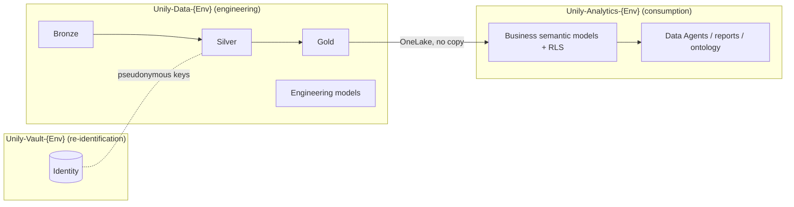

# Target architecture and naming convention

Status: accepted for the Blueprint. Items marked **unverified** still need a
lab experiment before production use.

## 1. Workspaces per environment

Each environment has three workspaces. The layer, not the domain or customer,
defines the workspace boundary.

| Workspace | Contains | Never contains |
| --- | --- | --- |
| **Data** | Bronze, Silver and Gold lakehouses; pipeline notebooks; configuration; engineering models (quality, volumes, monitoring). | Identity mapping; consumer access. |
| **Analytics** | Business semantic models with RLS, Data Agents, reports, and the future Fabric IQ ontology. Reads Gold only. | Copies of data; Bronze or Silver access. |
| **Vault** | Identity mapping, restricted PII audit and, if justified, an identified model. | Business consumers. |

Why the layer boundary:

- A workspace role applies to every current and future item in the workspace.
  Separating by layer makes isolation the default instead of a procedure.
- Spark processing and interactive consumption can use different capacities.
- The pipeline and consumption artifacts change at different speeds.
- Gold is the contract: Analytics is unaffected by pipeline rewrites while the
  Gold schema is stable.
- GDPR Art. 4(5): the additional information enabling re-identification is kept
  separately, with distinct access. Vault is optional in production; the data
  protection officer decides. It is always present in Dev and Test so the access
  flow is tested before production.

Not workspace boundaries:

- **Product and Support** share workspaces. They are separated by lakehouse
  schemas, workspace folders and separate semantic models. Fabric domains are
  assigned per workspace and therefore cannot separate them.
- **Customers** share workspaces and tables. They are separated by `tenant_id`
  and RLS. A dedicated customer workspace set is created only when a contract
  requires physical isolation.

## 2. Environments

| Environment | Code | GitHub Environment | Capacity |
| --- | --- | --- | --- |
| Development | `Dev` | `dev` | Existing lab F2 capacity |
| Test | `Test` | `test` | Existing lab F2 capacity |
| Production | `Prod` | `prod` | To be decided |

The lab assigns all workspaces to the existing F2 capacity. Because capacity
is assigned per workspace, the layer split lets production later place Data
(Spark processing) and Analytics (interactive queries, Data Agents) on
separate capacities, so heavy processing never slows consumption. This is a
recommendation, not a lab requirement.

All environments deploy the same repository definitions. Only private,
per-environment configuration (workspace and item IDs) differs.

## 3. Naming convention

General rules:

- English, no spaces, no accents.
- **Item names never contain the environment or workspace.** The same
  definition deploys unchanged to every environment.
- Use only the tokens listed below. Add a token by changing this document first.

Tokens:

| Token | Values |
| --- | --- |
| `<Layer>` | `Data`, `Analytics`, `Vault` |
| `<Env>` | `Dev`, `Test`, `Prod` |
| `<env>` | `dev`, `test`, `prod` (lowercase where the platform requires it) |
| `<Domain>` | `ProductAnalytics`, `Support`, `Shared` |
| `<schema>` | `product`, `support`, `shared` |
| `<Audience>` | `Safe` (pseudonymous, RLS), `Identified` (Vault only), `Ops` (engineering) |
| `<Purpose>` | `Engineers`, `Readers` (workspace roles); `Tenant<X>`, `AllTenants` (consumers) |
| `<X>` | Tenant letter in the synthetic scenario: `A`, `B`, `C` |

Patterns:

| Object | Pattern | Examples |
| --- | --- | --- |
| Workspace | `Unily-<Layer>-<Env>` | `Unily-Data-Dev`, `Unily-Analytics-Test`, `Unily-Vault-Prod` |
| Workspace folder | `<Domain>` | `ProductAnalytics`, `Support` |
| Medallion lakehouse (Data) | `Bronze`, `Silver`, `Gold` | `Gold` |
| Vault lakehouse | `Identity` | `Identity` |
| Lakehouse schema | `<schema>` | `product`, `support` |
| Table | `snake_case` noun | `usage_events`, `dim_user` |
| Notebook | `<Domain>_<Purpose>` | `ProductAnalytics_BronzeToSilver`, `ProductAnalytics_SilverToGold` |
| Variable Library (configuration only, not a notebook) | `<Domain>_Config` | `ProductAnalytics_Config` |
| Data pipeline, one per medallion stage | `<Domain>_<Stage>Pipeline` | `ProductAnalytics_SilverPipeline`, `ProductAnalytics_GoldPipeline` |
| Data pipeline, reproduction only | `<Domain>_Demo` | `ProductAnalytics_Demo` |
| Semantic model | `<Domain>_<Audience>` | `ProductAnalytics_Safe`, `Support_Safe`, `ProductAnalytics_Ops` |
| Data Agent | `<Domain>_<Audience>_Agent` | `ProductAnalytics_Safe_Agent` |
| Semantic model RLS role | `Tenant<X>`, `UnilyAll` | `TenantA`, `UnilyAll` |
| Entra security group (workspace role) | `Unily-<Layer>-<Env>-<Purpose>` | `Unily-Data-Dev-Engineers`, `Unily-Data-Dev-Readers` |
| Entra security group (consumers) | `Unily-Analytics-<Env>-<Purpose>` | `Unily-Analytics-Dev-TenantA`, `Unily-Analytics-Dev-AllTenants` |
| Workspace identity | Fabric names it after its workspace | `Unily-Analytics-Dev` |
| Cloud connection | `conn-unily-<layer>-<env>-<source>-<type>` | `conn-unily-analytics-dev-gold-onelake` |
| Deployment identity (app registration) | `unily-fabric-github-<env>` | `unily-fabric-github-dev` |
| Fabric capacity (Azure, production only) | `fcunily<tier>` (lowercase alphanumeric) | `fcunilydata`, `fcunilyanalytics` |
| GitHub Environment | `<env>` | `dev` |
| Environment settings (no IDs) | `config/environments/<env>/<domain>.json` | `config/environments/dev/product-analytics.json` |
| Git branch | `<feature\|fix\|maintenance\|docs>/<issue>-<slug>` | `docs/10-architecture-naming` |

Fabric items live in `fabric/<layer>/<domain>/<type>/<Name>.<FabricType>/`
(for example `fabric/data/shared/lakehouses/Gold.Lakehouse/`). The layer folder
selects the target workspace. Deployment resolves workspaces and item IDs by
name at run time, so no real identifier is stored in the repository or in
GitHub secrets.

Current tables (all in the `product` schema of schema-enabled lakehouses):

| Workspace | Lakehouse | Tables / files |
| --- | --- | --- |
| Data | Bronze | `users_<tenant>`, `events_<tenant>` (RAW, one pair per tenant) |
| Data | Silver | `usage_events` (pseudonymous, PII-masked, Change Data Feed enabled) |
| Data | Gold | `fact_usage_event`, `dim_user`, `dim_feature`, `dim_tenant`, `dim_date` ([contract](gold-contract.md)); watermark under `Files/product/state/` |
| Vault | Identity | `user_identity_map`; restricted audit under `Files/product/validation/` |

## 4. Access model

| Principal | Data | Analytics | Vault |
| --- | --- | --- | --- |
| Platform admins | Admin | Admin | Admin |
| Data engineers (`Unily-Data-<Env>-Engineers`) | Contributor | Viewer (target) | none |
| Data readers (`Unily-Data-<Env>-Readers`) | Viewer | none | none |
| Analytics developers | none | Contributor (target) | none |
| Privacy / authorized support | none | none | Viewer |
| Business consumers (`Unily-Analytics-<Env>-Tenant<X>`, `-AllTenants`) | **never** | item permission or app only | **never** |
| Analytics workspace identity | Viewer, plus the Gold `AnalyticsReader` OneLake role | owner | none |
| Deployment identity | Contributor | Contributor | Contributor |

- Grant access to groups, never to individual users.
- Consumers are never workspace members. They receive item-level access to
  semantic models, Data Agents or an app, and RLS filters by tenant
  ([semantic model](semantic-model.md)).
- Consumers never receive OneLake or SQL analytics endpoint access to Gold.
  Semantic models read Gold with the Analytics workspace identity through the
  `conn-unily-analytics-<env>-gold-onelake` connection.
- Gold uses OneLake security roles: `DefaultReader` (Fabric default),
  `AnalyticsReader` (the Analytics workspace identity, `Tables` read) and
  `DataReaders` (`Unily-Data-<Env>-Readers`, `Tables` read).
- Only the Bronze-to-Silver process writes to Vault.

## 5. Open validations

| Topic | Status |
| --- | --- |
| Direct Lake with RLS reading Gold in another workspace | **Verified** (#28) for Direct Lake on OneLake with a fixed workspace identity and semantic model RLS; deployed as `ProductAnalytics_Safe` (#11). See [semantic model](semantic-model.md) |
| Identity that runs Bronze-to-Silver across Data and Vault. Pipelines inject the Variable Library values as parameters, because NotebookUtils library reads do not support service principals. A pipeline-run notebook uses the pipeline's last modifier (the deployment service principal) | **Unverified** (#18): AI Functions and cross-workspace writes under a service principal. Alternative: a Workspace Identity connection |
| Object-level security in the same roles as RLS | Defined in `ProductAnalytics_Safe` (#30); validated in dev after deployment. See [semantic model](semantic-model.md#object-level-security) |
| Data Agent over the RLS/OLS model, queried as the signed-in user | `ProductAnalytics_Safe_Agent` deployed from the repository (#26); tenant isolation validated with the evaluation set after sharing. See [Data Agent](data-agent.md) |
| Schema-enabled lakehouses with deployment tooling | Created by `fabric-cicd`; first write to the `product` schema validated in #16. Direct Lake on the `product` schema validated in #28 |
| OneLake security as an alternative or complement to Vault | Not evaluated |
| OneLake security RLS enforced with the consumer's identity (SSO), instead of semantic model RLS | Not evaluated; possible evolution (see [semantic model](semantic-model.md)) |

## 6. Lab deviations

- The lab administrator owns the workspaces and the deployment service
  principal is a direct Contributor. Only the Data reader/engineer groups and
  the Analytics consumer groups exist; there are no admin, Analytics developer
  or Vault groups yet.
- Seven synthetic test users validate the consumer access matrix. Test-only
  direct shares are documented in [semantic model](semantic-model.md).
- Workspaces are provisioned locally by an administrator with
  `python tools/provision_environment.py` (plan by default, `--apply` to
  change). It is idempotent and never deletes workspaces, connections or role
  assignments. It also grants the deployment service principal `User` on the
  Gold connection so each deployment can rebind the semantic models.
- All environments of the lab share one F2 capacity. The Data/Analytics split
  allows separate capacities in production without moving items.
- Workspace folders are not published (`disable_workspace_folder_publish`).
