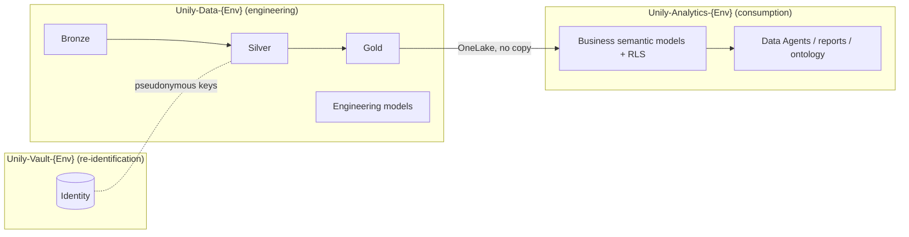

# Target architecture and naming convention

Status: accepted for the Blueprint. Items marked **unverified** still need a
lab experiment before production use.

## 1. Workspaces per environment

Each environment has three workspaces. The layer, not the domain or customer,
defines the workspace boundary.

| Workspace | Contains | Never contains |
| --- | --- | --- |
| **Data** | Bronze, Silver and Gold lakehouses; pipeline notebooks; configuration; engineering models (quality, volumes, monitoring). | Identity mapping; consumer access. |
| **Analytics** | Business semantic models with RLS, Data Agents, reports, and the future Fabric IQ ontology. Reads Gold only. | Copies of data; Bronze or Silver access. |
| **Vault** | Identity mapping, restricted PII audit and, if justified, an identified model. | Business consumers. |

Why the layer boundary:

- A workspace role applies to every current and future item in the workspace.
  Separating by layer makes isolation the default instead of a procedure.
- Spark processing and interactive consumption can use different capacities.
- The pipeline and consumption artifacts change at different speeds.
- Gold is the contract: Analytics is unaffected by pipeline rewrites while the
  Gold schema is stable.
- GDPR Art. 4(5): the additional information enabling re-identification is kept
  separately, with distinct access. Vault is optional in production; the data
  protection officer decides. It is always present in Dev and Test so the access
  flow is tested before production.

Not workspace boundaries:

- **Product and Support** share workspaces. They are separated by lakehouse
  schemas, workspace folders and separate semantic models. Fabric domains are
  assigned per workspace and therefore cannot separate them.
- **Customers** share workspaces and tables. They are separated by `tenant_id`
  and RLS. A dedicated customer workspace set is created only when a contract
  requires physical isolation.

## 2. Environments

| Environment | Code | GitHub Environment | Capacity |
| --- | --- | --- | --- |
| Development | `Dev` | `dev` | Existing lab F2 capacity |
| Test | `Test` | `test` | Existing lab F2 capacity |
| Production | `Prod` | `prod` | To be decided |

The lab assigns all workspaces to the existing F2 capacity. Because capacity
is assigned per workspace, the layer split lets production later place Data
(Spark processing) and Analytics (interactive queries, Data Agents) on
separate capacities, so heavy processing never slows consumption. This is a
recommendation, not a lab requirement.

All environments deploy the same repository definitions. Only private,
per-environment configuration (workspace and item IDs) differs.

## 3. Naming convention

General rules:

- English, no spaces, no accents.
- **Item names never contain the environment or workspace.** The same
  definition deploys unchanged to every environment.
- Use only the tokens listed below. Add a token by changing this document first.

Tokens:

| Token | Values |
| --- | --- |
| `<Layer>` | `Data`, `Analytics`, `Vault` |
| `<Env>` | `Dev`, `Test`, `Prod` |
| `<env>` | `dev`, `test`, `prod` (lowercase where the platform requires it) |
| `<Domain>` | `ProductAnalytics`, `Support`, `Shared` |
| `<schema>` | `product`, `support`, `shared` |
| `<Audience>` | `Safe` (pseudonymous, RLS), `Identified` (Vault only), `Ops` (engineering) |
| `<Role>` | `Admins`, `Contributors`, `Viewers` |

Patterns:

| Object | Pattern | Examples |
| --- | --- | --- |
| Workspace | `Unily-<Layer>-<Env>` | `Unily-Data-Dev`, `Unily-Analytics-Test`, `Unily-Vault-Prod` |
| Workspace folder | `<Domain>` | `ProductAnalytics`, `Support` |
| Medallion lakehouse (Data) | `Bronze`, `Silver`, `Gold` | `Gold` |
| Vault lakehouse | `Identity` | `Identity` |
| Lakehouse schema | `<schema>` | `product`, `support` |
| Table | `snake_case` noun | `usage_events`, `dim_user` |
| Notebook | `<Domain>_<Purpose>` | `ProductAnalytics_BronzeToSilver`, `ProductAnalytics_SilverToGold` |
| Variable Library (configuration only, not a notebook) | `<Domain>_Config` | `ProductAnalytics_Config` |
| Semantic model | `<Domain>_<Audience>` | `ProductAnalytics_Safe`, `Support_Safe`, `ProductAnalytics_Ops` |
| Data Agent | `<Domain>_<Audience>_Agent` | `ProductAnalytics_Safe_Agent` |
| Entra security group | `SG-Unily-<Layer>-<Env>-<Role>` | `SG-Unily-Data-Prod-Contributors` |
| Consumer group | `SG-Unily-Analytics-<Env>-<Domain>-Consumers` | `SG-Unily-Analytics-Prod-Support-Consumers` |
| Deployment identity | `SP-Unily-Deploy-<Env>` | `SP-Unily-Deploy-Dev` |
| Fabric capacity (Azure, production only) | `fcunily<tier>` (lowercase alphanumeric) | `fcunilydata`, `fcunilyanalytics` |
| GitHub Environment | `<env>` | `dev` |
| Environment secret | `<DOMAIN>_RUNTIME_CONFIG_JSON` | `PRODUCT_RUNTIME_CONFIG_JSON` |
| Git branch | `<feature\|fix\|maintenance\|docs>/<issue>-<slug>` | `docs/10-architecture-naming` |

Repository layout for Fabric items will follow
`fabric/<layer>/<domain>/<type>/<Name>.<FabricType>/` (for example
`fabric/data/shared/lakehouses/Gold.Lakehouse/`). It is introduced with dev
workspace provisioning (#12); until then the current layout remains valid.

## 4. Access model

| Group | Data | Analytics | Vault |
| --- | --- | --- | --- |
| Platform admins | Admin | Admin | Admin |
| Data engineers | Contributor | Viewer | none |
| Analytics developers | none | Contributor | none |
| Privacy / authorized support | none | none | Viewer |
| Business consumers | **never** | item permission or app only | **never** |
| Deployment identity | Contributor | Contributor | Contributor |

- Grant access to groups, never to individual users.
- Consumers are never workspace members. They receive item-level access to
  semantic models, Data Agents or an app, and RLS filters by tenant.
- Only the Bronze-to-Silver process writes to Vault.

## 5. Open validations

| Topic | Status |
| --- | --- |
| Direct Lake with RLS reading Gold in another workspace (direct or OneLake shortcut) | **Unverified** (#11) |
| Identity that runs Bronze-to-Silver across Data and Vault. NotebookUtils Variable Library reads do not support service principals today. | **Unverified** (#12) |
| Schema-enabled lakehouses with Direct Lake and deployment tooling | **Unverified** (#12) |
| OneLake security as an alternative or complement to Vault | Not evaluated |
